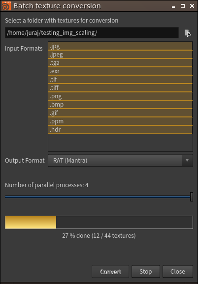
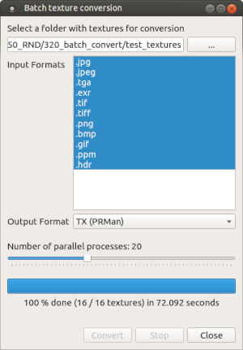
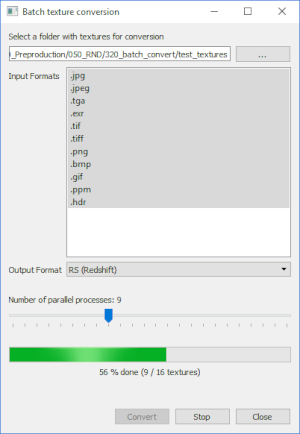

Batch Textures Conversion
=========================
*Batch convert textures to various render-friendly mip-mapped formats*

<br>

Intro
-----
This tool helps with pre-processing of textures for offline renderers. It can be used from Houdini or as a standalone application.

Renderers usually convert common texture formats *(jpg, png, tga..)* into more render friendly mip-mapped formats *(rat, rs, tx..)* which can be a time consuming process. Mainly if the renderer discards the converted texture afterwards and this process gets repeated.

It is therefore more efficient to pre-convert them once and let renderers use them.





<br>

Installation
------------
1. [Download](https://github.com/jtomori/batch_textures_convert/archive/master.zip) or clone this repository.

2.  **Houdini**
    * Add this repository folder into your **HOUDINI_PATH** environment variable.
    * For example add this line into your **houdini.env** file:
    ```
    HOUDINI_PATH = &;/path/to/this/repo/
    ```
    * Display **Batch Convert** shelf in Houdini

    **Standalone**
    * This tool requires **PySide2**
    * If missing, then install it for example with **pip** *(Linux and Windows)*
        ```
        $ python -m pip install --index-url=http://download.qt.io/snapshots/ci/pyside/5.9/latest/ pyside2 --trusted-host download.qt.io
        ```

<br>

Usage
-----
* Start the tool
    * **Houdini**
        * Click on **Batch Convert** shelf tool
    *  **Standalone**
        * `$ python batch_textures_converter.py`
* Select a root folder containing textures you want to convert, it will be scanned recursively
* Select which input texture formats should be converted
    * For example you could convert only jpegs or pngs
* Select output texture format
* Set number of parallel proecsses to run
    * Assign some of your threads for the conversion
    * Note that it does not scale linearly and at some point you will hit disk/network IO limit
* Confirm

<br>

A few notes
-----------
This tool works on Linux and Windows. Feel free to test it under and contribute for OS X version. <br>
Right now the following output formats are supported:
* .rat - Mantra
* .tx - Arnold / PRMan
* .rs - Redshift

However it is easy to extend / modify this tool so that it suits your needs. <br>

To add new output format, simply implement a new class in **scripts/python/batch_convert/converters.py**, which inherits from **GenericCommand()** class. Class is very simple, so it should be straightforward to add your custom output formats. <br>

This tool relies on external executables to perform conversion (e.g. *iconvert* for *RAT*, *maketx* for *TX*...). Make sure that you have them available in your system's **PATH** variable. If an executable is not found, then it will print a warning and will hide it from the output formats list.