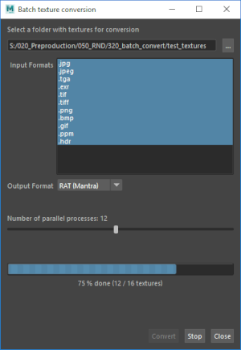
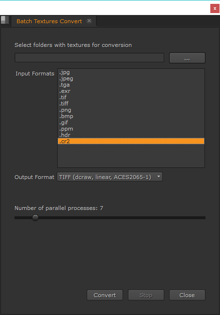
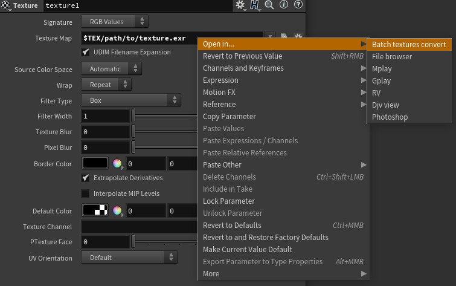
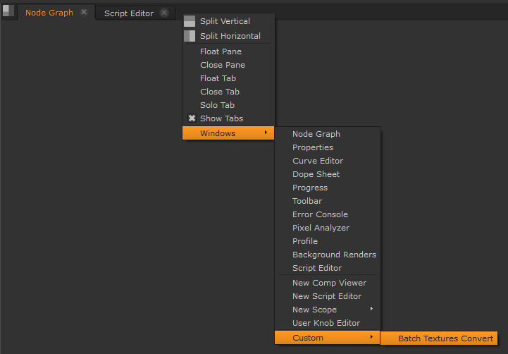

Batch Textures Conversion
=========================
*Batch convert textures to various render-friendly mip-mapped formats*

<br>

:information_source: Note that this tool is no longer maintained. TOPs in recent Houdini versions are good replacement for it. See [this blog post](https://jtomori.github.io/2022/2022-01-05.html) for more info.

<br>

Intro
-----
This tool helps with pre-processing of textures for offline renderers. It can be used from Houdini, Maya, Nuke or as a standalone application.

Renderers usually convert common texture formats *(jpg, png, tga..)* into more render friendly mip-mapped formats *(rat, rs, tx..)* which can be a time consuming process. Mainly if the renderer discards the converted texture afterwards and this process gets repeated many times.

It is therefore more efficient to pre-convert them once and let renderers use them.

It can be also used as a batch images converter, e.g. for converting raw photos with dcraw.

<br>

     
<br>

*Screenshots from Houdini, Ubuntu standalone, Windows standalone, Maya and Nuke*

You can see video of this tool [here](https://www.youtube.com/watch?v=5-p3__vsktg).

<br>

Installation
------------
1. [Download](https://github.com/jtomori/batch_textures_convert/archive/master.zip) or clone this repository.

2.  **Houdini**
    * Add this repository folder into your **HOUDINI_PATH** environment variable.
    * For example add this line into your **houdini.env** file:
    ```
    HOUDINI_PATH = &;/path/to/this/repo/
    ```
    * Display **Batch Convert** shelf in Houdini

    **Maya**
    * Add **./scripts/python** folder from this repository into your **PYTHONPATH** environment variable
    * For example add this line into your **Maya.env** file:
    ```
    PYTHONPATH=/path/to/this/repo/scripts/python
    ```

    **Nuke**
    * Add **./scripts/python** folder from this repository into your **PYTHONPATH** environment variable
    * Add **./nuke** folder from this repository into your **NUKE_PATH** environment variable
    * For example your batch environment file can look like this:
    ```
    set "PYTHONPATH=%PYTHONPATH%;/path/to/this/repo/scripts/python"
    set "NUKE_PATH=%NUKE_PATH%;/path/to/this/repo/nuke"
    ```

    **Standalone**
    * This tool requires **PySide2**
    * If missing, then install it for example with **pip**
        ```
        $ python -m pip install pyside2
        ```

<br>

Usage
-----
* Start the tool
    * **Houdini**
        * There are two ways of running the tool:
            1. Click on **Batch Convert** shelf tool
            2. Right-click on string parameter containing texture path
                * 
                * [Tutorial explaining this menu](https://jurajtomori.wordpress.com/2018/05/24/houdini-tip-open-parameter-path-in-file-browser/)
    * **Maya**
        * Run the following script from script editor or as a shelf tool
        ```
        import batch_convert
        gui = batch_convert.runGui()
        ```
    * **Nuke**
        * Display **Batch Textures Convert** pane tab by right-clicking on pane header: *Windows/Custom/Batch Textures Convert*
        * 
    *  **Standalone**
        * `$ python batch_textures_converter.py`
            * you can specify optional `--path` argument, which will set folder path (see `$ python batch_textures_converter.py --help` for help)
* Select a root folder containing textures you want to convert, it will be scanned recursively
    * You can also select/copypaste multiple folders, they will be separated with `" /// "`
* Select which input texture formats should be converted
    * For example you could convert only jpegs or pngs
* Select output texture format
* Set number of parallel processes to be run
    * Note that it does not scale linearly and at some point you will hit disk/network IO limit
* Confirm

<br>

A few notes
-----------
* This tool works on Linux and Windows. Feel free to test it under and contribute for OS X version.
    Right now the following output formats are supported:
    
    * .rat - Mantra (iconvert)
    * .tx - Arnold (maketx)
    * .tx - PRMan (maketx)
    * .rs - Redshift (redshiftTextureProcessor)
    * .tiff - Dcraw (dcraw)
    * .exr - OpenImageIO (oiiotool)
    
    However it is easy to extend / modify this tool so that it suits your needs. Note that those are only presets. Those tools can handle more formats and can be customized for different cases. Check man pages of the tools for more information.

* To add new output format, simply implement a new class in **scripts/python/batch_convert/converters.py**, which inherits from **GenericCommand()** class. Class is very simple, so it should be straightforward to add your custom output formats.

* This tool relies on external executables to perform conversion (e.g. *iconvert* for *RAT*, *maketx* for *TX*...). Make sure that you have them available in your system's **PATH** variable. If an executable is not found, then it will print a warning and will hide it from the output formats list in gui.

* `batch_convert.runGui()` accepts optional argument: `path`, use it setting default folder path

* If there are multiple textures with the same name, but different extensions, the tool will pick the one with the highest priority, as specified in `ext_priority` list in `__init__.py`

* Check beggining of `__init__.py` for configuration

<br>

Contributing
------------
Feel free to contribute to this project by creating pull requests or by [buying me a beer :)](https://www.paypal.me/jurajtomori)